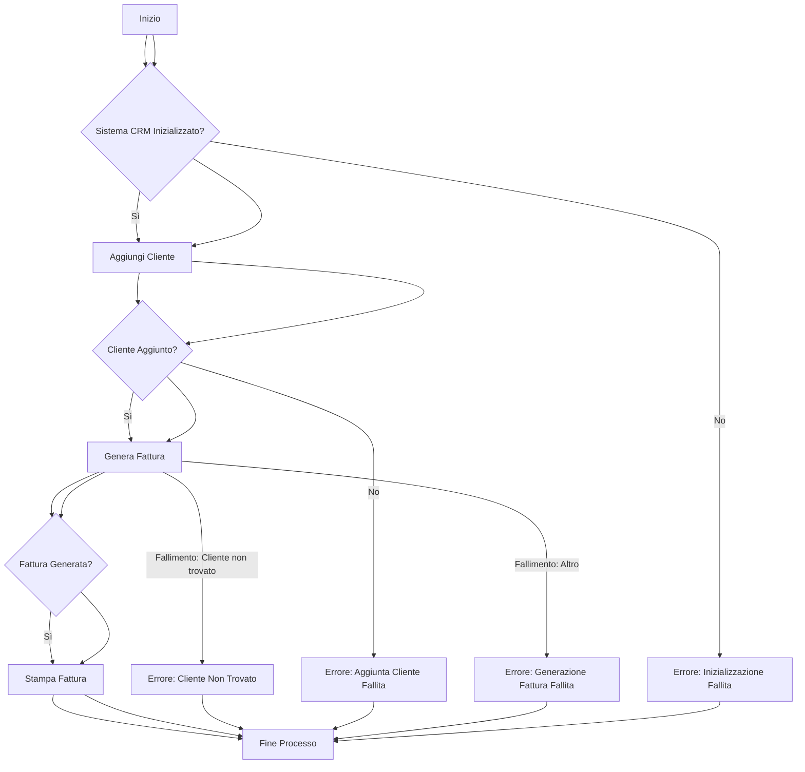

# Requisiti Funzionali Dettagliati

**Data di Generazione:** 27/10/2025
**Autore:** CodeVolver AI

## 1. Introduzione e Contesto

- **Scopo del Documento:** Questo documento ha lo scopo di delineare in dettaglio i requisiti funzionali del sistema CRM base, focalizzato sulla gestione di clienti e fatture retail, analizzando il codice sorgente fornito. L'obiettivo è fornire una documentazione chiara, strutturata e immediatamente utilizzabile per lo sviluppo, il testing e la gestione del progetto su piattaforme enterprise.

- **Contesto di Business:** La funzionalità analizzata risponde all'esigenza primaria di piccole attività retail o professionisti che necessitano di una soluzione semplice e autonoma per gestire il proprio portafoglio clienti e l'emissione di fatture. Permette di registrare i dati anagrafici dei clienti e di generare rapidamente fatture di vendita, fornendo una base essenziale per la tracciabilità delle transazioni e la gestione delle relazioni con la clientela.

- **Panoramica della Funzionalità:** Il sistema implementa un CRM di base che consente la creazione e la gestione di anagrafiche cliente (ID, nome, email) e la generazione di fatture associate a specifici clienti. Ogni fattura include un ID, il riferimento al cliente, l'importo e la data di emissione, con la possibilità di essere stampata in un formato testuale predefinito. Tutte le operazioni sono gestite in memoria, senza persistenza su database o file.

## 2. Diagramma di Flusso (Mermaid)

## 3. Requisiti Funzionali Specifici

| ID Requisito | Nome | Descrizione | Attori Coinvolti | Precondizioni | Postcondizioni |
|---|---|---|---|---|---|
| RF-CLI-001 | Gestione Anagrafica Cliente | Il sistema DEVE consentire l'aggiunta di nuovi clienti con un ID univoco, nome e indirizzo email. | Operatore CRM | Nessuna precondizione specifica, se non l'avvio del sistema. | Il cliente è aggiunto all'elenco dei clienti disponibili nel CRM. |
| RF-CLI-002 | Recupero Cliente | Il sistema DEVE consentire il recupero di un cliente tramite il suo ID per operazioni successive, come la generazione di fatture. | Operatore CRM | Il cliente con l'ID specificato DEVE esistere nel sistema. | Il sistema recupera l'oggetto cliente corrispondente all'ID. |
| RF-FAT-001 | Generazione Fattura | Il sistema DEVE consentire la generazione di una nuova fattura associata a un cliente esistente, specificando l'importo. La data di emissione DEVE essere automaticamente impostata alla data e ora correnti, se non diversamente specificato. | Operatore CRM | Il cliente associato alla fattura DEVE essere già registrato nel sistema. L'importo DEVE essere un valore numerico valido. | Viene creata una nuova fattura con un ID univoco, associata al cliente e all'importo specificato, con data di emissione. La fattura è aggiunta all'elenco delle fatture. |
| RF-FAT-002 | Visualizzazione Fattura | Il sistema DEVE consentire la generazione di una rappresentazione testuale formattata della fattura, inclusi i dettagli del cliente, l'importo e la data di emissione. | Operatore CRM, Cliente (per ricezione) | La fattura DEVE essere stata precedentemente generata. | Viene restituita una stringa formattata con i dettagli della fattura. |

## 4. Comportamento Atteso e Regole di Business

**Comportamento Atteso:**

*   **Inizializzazione Sistema:** All'avvio, il sistema CRM sarà inizializzato con un elenco vuoto di clienti e fatture.
*   **Aggiunta Cliente:** Quando un operatore richiede di aggiungere un cliente, il sistema registrerà il `id_cliente`, `nome` e `email` forniti. L'oggetto `Cliente` sarà memorizzato in una collezione interna, accessibile tramite il `id_cliente`.
*   **Generazione Fattura:** Per generare una fattura:
    *   Il sistema tenterà di recuperare il cliente associato tramite l'ID fornito.
    *   Se il cliente non esiste, il sistema DEVE sollevare un'eccezione (`ValueError`) segnalando che il cliente non è stato trovato.
    *   Se il cliente esiste, verrà generato un `id_fattura` progressivo (basato sul numero di fatture già presenti).
    *   La `data_emissione` della fattura sarà impostata automaticamente alla data e ora corrente (`datetime.now()`) al momento della creazione, a meno che non sia esplicitamente fornita.
    *   L'oggetto `Fattura` sarà creato e aggiunto all'elenco interno delle fatture.
*   **Stampa Fattura:** Quando una fattura viene stampata, il sistema restituirà una stringa di testo formattata che include il nome del cliente, l'email del cliente, l'importo (formattato a due cifre decimali) e la data di emissione (formattata `GG/MM/AAAA`).

**Regole di Business:**

*   **Unicità ID Cliente (implicita):** Ogni cliente è identificato da un `id_cliente` univoco. L'implementazione attuale utilizza un dizionario, il che garantisce l'unicità della chiave `id_cliente`, sovrascrivendo eventuali clienti esistenti con lo stesso ID se tentassero di essere aggiunti nuovamente.
*   **Associazione Cliente-Fattura:** Ogni fattura DEVE essere associata a un cliente esistente nel sistema. Non è possibile generare fatture per clienti inesistenti.
*   **ID Fattura Sequenziale:** L'ID di una fattura viene generato automaticamente in modo sequenziale, incrementando di uno rispetto al numero totale di fatture già emesse.
*   **Formattazione Importo:** L'importo delle fatture DEVE essere visualizzato con due cifre decimali, preceduto dal simbolo di valuta '€'.
*   **Formattazione Data:** La data di emissione della fattura DEVE essere visualizzata nel formato `GG/MM/AAAA`.
*   **Data Emissione Predefinita:** Se non specificata, la data di emissione di una fattura DEVE corrispondere alla data e ora di creazione della fattura stessa.

## 5. Casi di Test e Criteri di Accettazione

### Per RF-CLI-001: Gestione Anagrafica Cliente

| ID Test | Descrizione | Dati di Input | Risultato Atteso | Criteri di Successo |
|---|---|---|---|---|
| TC-CLI-001 | Aggiunta di un nuovo cliente | `id=1`, `nome="Mario Rossi"`, `email="mario.rossi@email.com"` | Un nuovo oggetto `Cliente` con i dati forniti viene creato e aggiunto al CRM. | `crm.clienti[1].nome` è `"Mario Rossi"`; `crm.clienti[1].email` è `"mario.rossi@email.com"`. |
| TC-CLI-002 | Aggiunta di un cliente con ID esistente (sovrascrittura) | Prima: `id=1`, `nome="Mario Rossi"`. Poi: `id=1`, `nome="Luigi Verdi"`, `email="luigi.verdi@email.com"` | Il cliente con `id=1` viene aggiornato con i nuovi dati (`Luigi Verdi`). | `crm.clienti[1].nome` è `"Luigi Verdi"`; `crm.clienti[1].email` è `"luigi.verdi@email.com"`. |

### Per RF-FAT-001: Generazione Fattura

| ID Test | Descrizione | Dati di Input | Risultato Atteso | Criteri di Successo |
|---|---|---|---|---|
| TC-FAT-001 | Generazione fattura per cliente esistente | Cliente con `id=1` già aggiunto. `id_cliente=1`, `importo=120.50` | Viene creata una nuova fattura con ID progressivo, associata al cliente `Mario Rossi`, importo `120.50` e data di emissione corrente. | `len(crm.fatture)` aumenta di 1. La fattura ha `id_fattura=1` (o successivo), `cliente` è l'oggetto `Mario Rossi`, `importo` è `120.50`. |
| TC-FAT-002 | Generazione fattura per cliente inesistente | Nessun cliente con `id=99`. `id_cliente=99`, `importo=50.00` | Viene sollevata una `ValueError` con il messaggio "Cliente non trovato.". | Il sistema lancia `ValueError` e `len(crm.fatture)` non cambia. |

### Per RF-FAT-002: Visualizzazione Fattura

| ID Test | Descrizione | Dati di Input | Risultato Atteso | Criteri di Successo |
|---|---|---|---|---|
| TC-FAT-003 | Stampa fattura generata | Fattura generata da TC-FAT-001 (`id=1`, `cliente="Mario Rossi"`, `importo=120.50`, `data_emissione=Oggi`) | Una stringa formattata con i dettagli della fattura. | La stringa contiene `"Cliente: Mario Rossi"`, `"Email: mario.rossi@email.com"`, `"Importo: €120.50"`, `"Data: GG/MM/AAAA"` (con la data odierna). |

## 6. Moduli e Componenti Interessati

| Componente | Responsabilità | Dipendenze |
|---|---|---|
| `Cliente` (Classe) | Rappresenta un'entità cliente con le sue proprietà (ID, nome, email). | Nessuna. |
| `Fattura` (Classe) | Rappresenta un'entità fattura con le sue proprietà (ID, cliente, importo, data_emissione) e la logica per la sua rappresentazione testuale. | `Cliente`, `datetime` (per data_emissione predefinita). |
| `CRM` (Classe) | Il core del sistema CRM; gestisce le collezioni di clienti e fatture, e le logiche di business per aggiunta e generazione. | `Cliente`, `Fattura`. |
| `aggiungi_cliente()` (Metodo di `CRM`) | Crea e memorizza un nuovo oggetto `Cliente` nel sistema. | `Cliente`. |
| `genera_fattura()` (Metodo di `CRM`) | Recupera un cliente esistente e crea una nuova `Fattura` associata, memorizzandola nel sistema. | `Cliente`, `Fattura`. |
| `stampa_fattura()` (Metodo di `Fattura`) | Genera una stringa formattata contenente tutti i dettagli della fattura per la visualizzazione. | Nessuna (utilizza i propri attributi). |

## 7. Rischi e Impatti Potenziali

### Rischi Funzionali:

*   > ⚠️ **Attenzione:** **Perdita di Dati (Persistenza):** Il sistema opera esclusivamente in memoria. Tutti i dati di clienti e fatture andranno persi alla chiusura dell'applicazione. Non c'è alcun meccanismo di salvataggio o caricamento dei dati. Questo è il rischio più significativo.
*   > ⚠️ **Attenzione:** **Mancanza di Validazione Input:** Non è presente alcuna validazione sull'input per `nome`, `email` o `importo`. Ad esempio, è possibile inserire importi negativi o email non valide, il che può portare a dati inconsistenti o errori in fase di stampa/calcolo futuro.
*   > ⚠️ **Attenzione:** **Gestione ID Duplicati (Cliente):** L'attuale implementazione di `aggiungi_cliente` sovrascrive un cliente se un nuovo cliente con lo stesso `id_cliente` viene aggiunto. Questo può essere un comportamento desiderato per l'aggiornamento, ma è un rischio se si intende impedire ID duplicati o richiedere una conferma di sovrascrittura.
*   > ⚠️ **Attenzione:** **Scalabilità Limitata:** L'utilizzo di liste e dizionari in memoria rende il sistema non scalabile per un elevato numero di clienti e fatture, portando a problemi di performance e consumo di memoria.

### Impatti su Altri Sistemi:

*   Data la natura standalone e in-memory del sistema, l'impatto su altri sistemi è **nullo** nella sua versione attuale.
*   In futuro, se il CRM dovesse essere integrato con altri sistemi (es. contabilità, e-commerce, gestione magazzino), la mancanza di persistenza dei dati e l'assenza di API esterne costituirebbero un impedimento significativo. La sua evoluzione richiederà l'introduzione di un livello di persistenza e probabilmente di un'interfaccia di comunicazione (es. API REST).

## 8. Conclusioni e Note

Questa analisi del codice sorgente rivela un'implementazione di base ma funzionale per la gestione elementare di clienti e fatture in un contesto retail. La struttura a classi è chiara e ben organizzata per le funzionalità attuali.

**Note per gli Sviluppatori/Tester:**

*   **Priorità:** La priorità assoluta per un'evoluzione di questo sistema è l'introduzione di un meccanismo di persistenza dei dati (es. database SQL/NoSQL o file system) per evitare la perdita di informazioni alla chiusura dell'applicazione.
*   **Validazione:** Implementare una robusta validazione degli input (es. formato email, importi positivi) per migliorare l'integrità dei dati.
*   **Error Handling:** Migliorare la gestione degli errori, magari definendo tipi di eccezione specifici per scenari come "Cliente non trovato" o "Dati non validi", per consentire una gestione più granulare da parte del chiamante.
*   **Unicità ID:** Chiarire la politica desiderata per la gestione degli ID cliente duplicati: se devono essere univoci senza sovrascrittura o se la sovrascrittura è il comportamento atteso per gli aggiornamenti. In quest'ultimo caso, considerare di aggiungere un metodo esplicito `aggiorna_cliente()`.
*   **Funzionalità Aggiuntive:** Le prossime evoluzioni potrebbero includere la ricerca di clienti/fatture, la modifica dei dati esistenti, l'eliminazione, e la generazione di report.